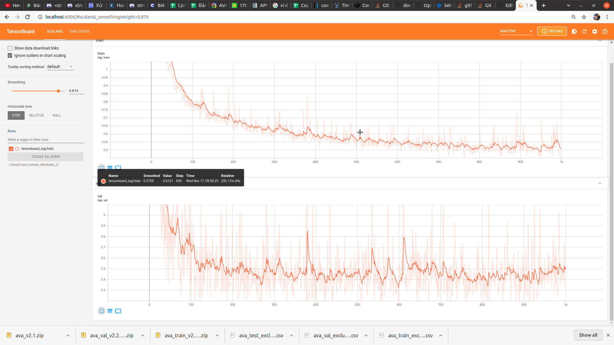

# CLASSIFICATION

Implement classification models for multi-task learning.

This work was inspired by [ultralytics/yolov5](https://github.com/ultralytics/yolov5) a lot.

### TODO

- [x] Models zoo

    - [x] MobilenetV2.

    - [ ] MobileNetV3.

    - [x] ResNet.

        - [x] ResNet18.

        - [x] ResNet34.

        - [x] ResNet50.

        - [x] Resnet101.

        - [x] Resnet152.

        - [x] Resnext101_32x8d

        - [x] wide_resnet50_2

        - [x] wide_resnet101_2

    - [ ] DenseNet.

    - [x] ShuffleNet.

        - [x] shufflenet_v2_x0.5

        - [x] shufflenet_v2_x1.0

    - [ ] EfficientNetV1.

    - [ ] EfficientNetV2.

- [x] Augmentation

    - [x] RandomAugment.

    - [x] AutoAugment.

    - [x] Photometric-augmentation.

        - [x] hist_equalize.

        - [x] invert.

        - [x] mix_up_gray_scale.

        - [x] adjust_brightness.

        - [x] solarize.

        - [x] posterize.

        - [x] contrast.

        - [x] hsv_augment.

        - [ ] mixup.

        - [ ] Blur.

        - [ ] Media-Blur.

    - [x] Geometrics-augmentation.

        - [x] shearX.

        - [x] shearY.

        - [x] translateX.

        - [x] translateY.

        - [x] Cut-out.

        - [x] Rotate.

        - [ ] Sharpness.

        - [ ] Center-crop.

- [x] Training strategy.

    - [x] Weight decay.

    - [x] Warm-up learning rate.

    - [ ] Learning Schedual.

    - [x] Early-stopping.

        - [x] macro-accuracy based-on.
        
        - [ ] macro-f1 based-on.

        - [x] val-loss based-on.

    - [ ] FixRes strategy. [detail](https://arxiv.org/pdf/1906.06423.pdf)

    - [ ] Progressive learning with adaptive regularization. [detail](https://arxiv.org/pdf/2104.00298.pdf)

    - [ ] Multi-task Learning with Labeled and Unlabeled Tasks [detail](http://proceedings.mlr.press/v70/pentina17a/pentina17a.pdf)

- [x] Data-format.

    - [x] Pandas-DataFrame.

        - [x] Single-sile csv.

        - [x] Multi-file csv.

    - [x] Folder-format.

- [x] Visualize.

    - [x] training progress (tensorboard).

    - [x] statistic

    - [ ] Confusion-matrix.

    - [ ] ROC. 

- [x] CallBacks. 

    - [ ] on_pretrain_routine_start.

    - [ ] on_pretrain_routine_end.

    - [ ] on_training_start. 

    - [ ] on_training_end.
        
    - [ ] on_epoch_start.

    - [x] on_epoch_end.
        
    - [x] on_bestfit_epoch_end. 
        
    - [x] on_model_save.

- [x] Imbalance data.

    - [ ] Oversampling.

    - [x] Undersampling

    - [x] weighted tasks.

    - [x] weighted classes.

    - [ ] weighted sample.

### REQUIREMENTS

`
    pip install -r requirement.txt
`

### FOLDER TREE

```

PROJECT

├── config/
|    ├── default/
|    |      ├── train_config.yaml
|    |      ├── data_config.yaml
|
|
├── source/
|    ├── models/
|    |      ├── mobilenetv2.py
|    |      ├── Resnet.py
|    |      ├── ...
|    |      ├── ...
|    |      ├── EfficientNet.py
|    ├── utils/
|    |      ├── dataset.py
|    |      ├── augmentations.py
|    |      ├── general.py
|    |      ├── torch_utils.py
|    |      ├── imbalance_data_handle.py
|    ├── train.py
|
|
├── result/                          
|    ├── runs_1/
|    ├── runs_2/
|    ├── ..... /
|    ├── runs_n/
|    |      ├── checkpoint/
|    |      |      ├── best.pt
|    |      |      ├── last.pt
|    |      ├── visualize/
|    |      |      ├── *.jpg
|
|
├── .gitignore
├── README.md
├── LICENSE
├── preprocess.py               
├── demo_video.py

```

## Training

See config file for more detail.
Put your whole data in DATA_FOLDER [config-file](config/default/data_config.yaml)
### 1.Pandas Format: 

colums-name:

- path : images-relative path with DATA_FOLDER 

- label_name_1 : must be the same with *classes in data_config.yaml. values can be 'class_name' or class_index

- ...

- label_name_n:

### 2.Folder-format

image-path : DATAFOLDER / label_1/ label_2 /.../ label_n / *.jpg

### 3.Run

```
    python source/train.py \
    --cfg YOUR_PATH/train_config.yaml \
    --data YOUR_PATH/data.yaml 
```

### 4.Tensorboard     

```
    cd SAVE_DIR
    tensorboard --logdir=tensorboard_log
```


## Reference 

[Deep Residual Learning for Image Recognition.](https://arxiv.org/abs/1512.03385)

[MobileNetV2: Inverted Residuals and Linear Bottlenecks.](https://arxiv.org/abs/1801.04381)

[ShuffleNet: An Extremely Efficient Convolutional Neural Network for Mobile Devices.](https://arxiv.org/abs/1707.01083)

[EfficientNet: Rethinking Model Scaling for Convolutional Neural Networks.](https://arxiv.org/abs/1905.11946v1?fbclid=IwAR15HgcBlYsePX34qTK2aHti_GiucEYpQHjben-8wsTf7O83YPhrJQgXEJ0)


